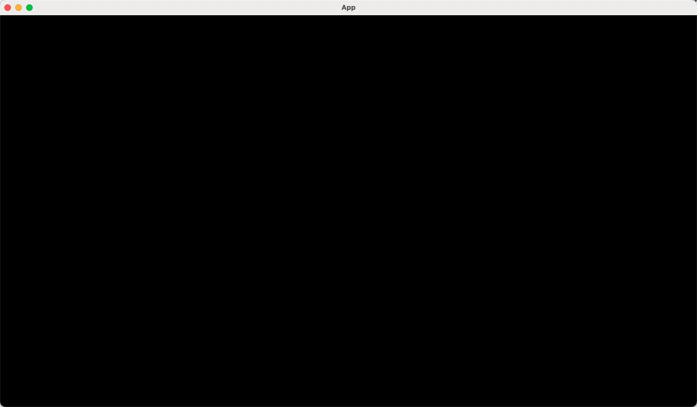

# 第一天：创建项目并简单了解Bevy

## 1、创建项目
首先我们来创建项目，使用rust的命令创建一个项目并添加依赖。

1.  使用命令初始化项目
    ```
    cargo new Bevy-minesweeper 
    ```

2.  在项目中添加Bevy依赖
    ```
    cd 
    cargo add bevy
    ```


完成后以上步骤后Cargo.toml大概是这个样子，代表项目创建成功了。
```
[package]
name = "bevy-minesweeper-tutorial"
version = "0.1.0"
edition = "2021"

[dependencies]
bevy = "0.11.3"
```

## 2、体验Bevy
###  初始化Bevy项目并启动
    
修改main.rs为如下代码
```rust
use bevy::prelude::*;

fn main() {
    App::new().add_plugins(DefaultPlugins).run();
}
```

然后在项目根目录下运行项目
```
cargo run
```

正常情况下就会看到一个黑屏的程序启动

目前屏幕上什么都没有，纯粹一个黑屏，这是因为添加了Bevy的默认插件集，里面有窗口相关的Plugin，后续我们会在设置窗口属性的时候再讲到这个插件
[更多DefaultPlugins的信息点击查看](https://docs.rs/bevy/latest/bevy/prelude/struct.DefaultPlugins.html)
现在我们就已经成功完成了项目的初始化。

###  介绍Bevy ECS 的使用
    
在Bevy的ECS系统中，主要有三个部分组成
-   组件 Component
    用户定义各种组件。
    在我们的扫雷中，每个格子就可以当做一个组件，格子上显示的精灵也可以是一个组件，这些组件最终添加到Bevy中打包成一个实体(Entity)

-   资源 Resource
    用户定义的各种数据。
    资源代表了我们游戏中的各种独立的数据，扫雷中具体有多少个雷，棋盘是多长多宽等数据，就可以定义为资源。
    
-   系统 System
    用户定义的各种逻辑。
    系统是指扫雷中的各种具体逻辑，例如初始化棋盘，点击翻开格子，标记格子，赢得游戏，重开游戏等。

1.  首先我们就可以先定义一个资源，用来设定扫雷的基础选项:
    创建目录resources，并在下面创建文件
    ```rust
    // board_options.rs
    use bevy::prelude::*;

    #[derive(Resource)]
    pub struct BoardOptions {
        pub width: u16,
        pub height: u16,
        pub bomb_count: u16,
    }

    impl Default for BoardOptions {
        fn default() -> Self {
            Self { width: 9, height: 9, bomb_count: 10 }
        }
    }
    ``` 
    在struct上添加`#[derive(Resource)]`表示为一个资源，并且我们实现了Default，设置了棋盘的默认属性为9*9大小，10个雷

    在main方法中添加自动初始化资源的方法，Bevy会帮你初始化该资源，后续就可以直接使用
    ```rust
        // main.rs
        App::new()
    ++      .init_resource::<BoardOptions>()
            .add_plugins(DefaultPlugins).run();
    ```
    这样，我们就已经添加好我们的第一个资源：棋盘基础设置项。

2.  我们来尝试在Bevy中输出这个设置：

    在main方法中添加一个函数：
    ```rust
    // main.rs
    fn print_options(options: Res<BoardOptions>) {
        println!("{:?}", options);
    }
    ```
    这里`Res<BoardOptions>`就表示了在这个函数中我们需要用到之前定义的资源，直接写到入参就可以使用了。(这里为了输出，注意在BoardOptions上添加Debug特征)
    接下来把函数添加到Bevy中，依然是main：

    ```rust
        // main.rs
        App::new()
            .init_resource::<BoardOptions>()
            .add_plugins(DefaultPlugins).run();
            .add_plugins(DefaultPlugins)
    ++      .add_systems(Update, print_options)
            .run();
    ```

    重新运行一次程序`cargo run`, 就会看到控制台在不断循环输出了
    ```
    Res(BoardOptions { width: 9, height: 9, bomb_count: 10 })
    ```
    这是因为我们增加的这个函数使用的是`Update`，表示在Bevy每次更新渲染时都调用，所以会循环输出，这里可以把`Update`更新为`Startup`，就会看到输出只会在启动的时候输出一次了，这就是Bevy的系统System。

    我们只需要写逻辑， 并标明逻辑需要使用到的组件，资源等，并注册到Bevy中，剩下的，Bevy都帮我们完成了！

    除了`Startup`，`Update`，Bevy中还有更多更复杂的调度方式，后续我们会慢慢接触。

3.  现在资源和系统都有了初步的认识，还没有看到组件。
    我们先在系统中添加一个基础的显示组件：镜头。
    添加以下代码到main.rs并注册为`Startup`,这样在启动的时候就会为我们增加一个镜头组件。
    ```rust
    // main.rs
    fn setup_camera(mut commands: Commands) {
        commands.spawn(Camera2dBundle::default());
    }
    ```
    ```rust
        App::new()
            .init_resource::<BoardOptions>()
            .add_plugins(DefaultPlugins)
    +++     .add_systems(Startup, setup_camera)
            .add_systems(Startup, print_options)
            .run();
    ```
    镜头是Bevy为我们预设好的组件，因为我们是2d游戏，我们需要使用2d镜头，commands是Bevy提供给我们管理系统中组件和资源的，使用spawn就可以把组件添加到系统中去了。
    
    现在我们运行程序`cargo run`，屏幕不再是黑色的了，显示为灰色，这是镜头的底色，我们成功的添加镜头到系统中。
    

至此，我们对Bevy的整个ECS系统有了一个基础的认识，并成功启动了我们的项目（虽然他只有一个基础的设置数据），明天我们正式开始写扫雷逻辑，并且把他渲染到窗口中。