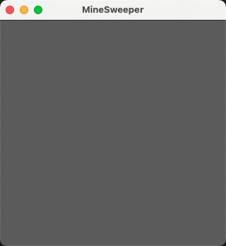
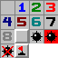
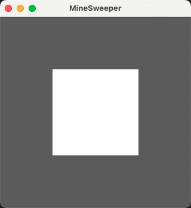
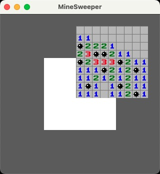
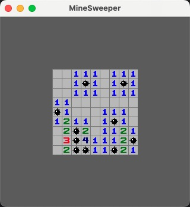
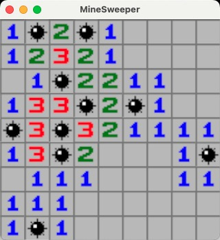
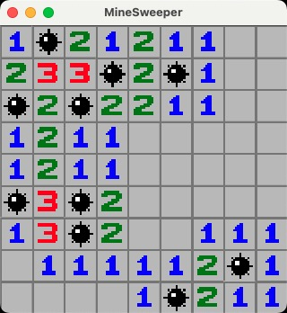

# 第二天：渲染棋盘

今天我们来生成整个棋盘的数据并且渲染到屏幕上。
让我们开始吧！

## 1、调整窗口大小
昨天我们创建了一个窗口，但他现在对我们来说实在太大了，我们先来学习配置一下窗口大小，让窗口变得适中

```rust
---     .add_plugins(DefaultPlugins)
+++     .add_plugins(
+++         DefaultPlugins.set(ImagePlugin::default_nearest()).set(WindowPlugin {
+++             primary_window: Some(Window {
+++                 title: "MineSweeper".into(),
+++                 resolution: (320.0, 320.0).into(),
+++                 ..Default::default()
+++             }),
+++             ..default()
+++         })
+++     )
```
在`DefaultPlugins`中有一个`WindowPlugin`，我们可以单独对他的设置属性，添加标题和设置窗口大小为320*320
现在我们看到窗口是一个不大不小的方形窗口


## 2、创建棋盘

接下来，我们来创建一个`board`资源，用来存储棋盘上的地雷和每格周围的地雷数量
在resources目录下创建board.rs文件并导出，直接上代码：
```rust
// board.rs
use bevy::prelude::*;
use rand::{ thread_rng, Rng };

use super::BoardOptions;

const SQUARE_COORD: [(i8, i8); 8] = [
    // Top Left
    (-1, 1),
    // Top
    (0, 1),
    // Top right
    (1, 1),
    // Left
    (-1, 0),
    // Right
    (1, 0),
    // Bottom left
    (-1, -1),
    // Bottom
    (0, -1),
    // Bottom right
    (1, -1),
];

#[derive(Resource, Debug, Default)]
pub struct Board {
    pub map: Vec<Vec<i8>>,
}

impl Board {
    pub fn reset(&mut self, board_options: &Res<BoardOptions>) {
        let width = board_options.width;
        let height = board_options.height;

        let area = width * height;
        let bomb_count = board_options.bomb_count;
        let mut rng = thread_rng();
        let mut map: Vec<i8>;
        if bomb_count < area / 2 {
            map = (0..height * width)
                .into_iter()
                .map(|i: u16| if i < area - bomb_count { 0 } else { -1 })
                .collect();
            for i in area - bomb_count..area {
                let idd = rng.gen_range(0..=i) as usize;
                let i: usize = i as usize;
                if map[idd] != -1 {
                    map[idd] = -1 as i8;
                    map[i] = 0 as i8;
                }
            }
        } else {
            map = (0..height * width)
                .into_iter()
                .map(|i| if i < bomb_count { -1 } else { 0 })
                .collect();
            for i in bomb_count..area {
                let idd = rng.gen_range(0..=i) as usize;
                let i = i as usize;
                if map[idd] != 0 {
                    map[idd] = 0 as i8;
                    map[i] = -1 as i8;
                }
            }
        }

        self.map = map
            .chunks(width as usize)
            .map(|k| k.iter().cloned().collect::<Vec<_>>())
            .collect();

        for y in 0..height {
            for x in 0..width {
                let coord = (x, y);
                if self.is_bomb_at(coord) {
                    continue;
                }
                self.map[y as usize][x as usize] = self.bomb_count_at(coord) as i8;
            }
        }
    }

    fn is_bomb_at(&self, coord: (u16, u16)) -> bool {
        let y = coord.1 as usize;
        let x = coord.0 as usize;
        if y >= self.map.len() {
            return false;
        }
        if x >= self.map[y].len() {
            return false;
        }
        self.map[y][x] == -1
    }

    fn bomb_count_at(&self, coord: (u16, u16)) -> u8 {
        if self.is_bomb_at(coord) {
            return 0;
        }
        let res = self
            .safe_square_at(coord)
            .filter(|coord| self.is_bomb_at(*coord))
            .count();
        res as u8
    }

    fn safe_square_at(&self, coord: (u16, u16)) -> impl Iterator<Item = (u16, u16)> {
        SQUARE_COORD.iter()
            .copied()
            .map(move |tuple| (
                (tuple.0 as i16) + (coord.0 as i16),
                (tuple.1 as i16) + (coord.1 as i16),
            ))
            .filter(|coord| coord.0 >= 0 && coord.1 >= 0)
            .map(|coord| (coord.0 as u16, coord.1 as u16))
    }

    pub fn console_output(&self) -> String {
        let separator: String = (0..=self.map.len() * 3)
            .into_iter()
            .map(|_| '-')
            .collect();
        format!(
            "{}\n{}\n{}",
            separator,
            self.map
                .iter()
                .map(|row|
                    format!(
                        "|{}|",
                        row
                            .iter()
                            .map(|column| format!("{:2}", column))
                            .collect::<Vec<_>>()
                            .join(" ")
                    )
                )
                .collect::<Vec<_>>()
                .join("\n"),
            separator
        )
    }
}

```
我们为`board`增加了两个方法，一个用来重置棋盘，一个用来输出当前棋盘到控制台。
我们来把它加到系统中并试着输出一下看看是否正确
在main中增加：
```rust
    App::new()
        .init_resource::<BoardOptions>()
+++     .init_resource::<Board>()
```
将print_options修改为
```rust
    fn print_options(
        options: Res<BoardOptions>,
+++     mut board: ResMut<Board>,
    ) {
        println!("{:?}", options);
+++     // 使用配置重置棋盘
+++     board.reset(&options);
+++     println!("{}", board.console_output());
    }
```
再次运行程序，在控制台就会得到类似如下的输出：
```
Res(BoardOptions { width: 9, height: 9, bomb_count: 10 })
----------------------------
| 2  1  0  0  1  1  1  0  0|
|-1  1  0  0  1 -1  1  0  0|
| 4  2  0  0  1  1  1  0  0|
|-1  2  1  2  1  1  0  0  0|
| 2  2 -1  2 -1  3  2  1  0|
| 0  1  1  2  2 -1 -1  1  0|
| 2  1  0  0  1  2  2  1  0|
|-1  1  0  0  1  1  1  1  1|
| 2  1  0  0  1 -1  1  1 -1|
----------------------------
```

很好，到这里，今天的课程已经完成一半了，剩下的就是把这个棋盘渲染到我们的屏幕上

## 3、渲染棋盘
接下来我们需要用到一个图片资源

将其放到`assets`目录下，这是Bevy静态资源的默认目录

生成棋盘需要用到随机数，我们增加一个`rand`包
```
cargo add rand
```

我们先在屏幕上渲染一个棋盘的基底，我们的图片尺寸是16\*16的，所以代码中所有单元格以16\*16为标准。
将print_options改名为setup_board并在原来的代码后追加代码：
```rust
    fn setup_board(
+++     mut commands: Commands,
        options: Res<BoardOptions>,
        mut board: ResMut<Board>,
    ) {
        // ...
        let tile_size = 16.0;
        let board_size = Vec2::new(
            (options.width as f32) * tile_size,
            (options.height as f32) * tile_size
        );
        commands.spawn((
                    SpriteBundle {
                        sprite: Sprite {
                            color: Color::WHITE,
                            custom_size: Some(board_size),
                            ..default()
                        },
                        transform: Transform::from_xyz(0.0, 0.0, 1.0),
                        ..default()
                    },
                ));
    }
```
这里使用了一个SpriteBundle，是用来渲染精灵的，可以用来渲染图片，我们这里直接渲染一个白色的背景。
运行程序，很好，现在可以看到屏幕这中间多了一个白色的方块。

我们继续，将所有的格子渲染到屏幕上，这时候就用到之前的图片了：
```rust
    fn setup_board(
        mut commands: Commands,
        options: Res<BoardOptions>,
        mut board: ResMut<Board>,
+++     asset_server: Res<AssetServer>,
+++     mut texture_atlases: ResMut<Assets<TextureAtlas>>
    ) {
        println!("{:?}", options);
        board.reset(&options);
        println!("{}", board.console_output());
        
+++     let texture_handle = asset_server.load("texture.png");
+++     let texture_atlas = TextureAtlas::from_grid(
+++         texture_handle,
+++         Vec2::new(16.0, 16.0),
+++         4,
+++         4,
+++         None,
+++         None
+++     );
+++     let texture_atlas_handle: Handle<TextureAtlas> = texture_atlases.add(texture_atlas);

        let tile_size = 16.0;
        let board_size = Vec2::new(
            (options.width as f32) * tile_size,
            (options.height as f32) * tile_size
        );

        commands
            .spawn((
                SpriteBundle {
                    sprite: Sprite {
                        color: Color::WHITE,
                        custom_size: Some(board_size),
                        ..default()
                    },
                    transform: Transform::from_xyz(0.0, 0.0, 1.0),
                    ..default()
                },
            ))
+++         .with_children(|commands| {
+++             for (y, row) in board.map.iter().enumerate() {
+++                 for (x, column) in row.iter().enumerate() {
+++                     let index = match column {
+++                         1..=8 => { *column as usize }
+++                         -1 => { 10 }
+++                         _ => { 0 }
+++                     };
+++                     commands.spawn((
+++                         SpriteSheetBundle {
+++                             texture_atlas: texture_atlas_handle.clone(),
+++                             sprite: TextureAtlasSprite {
+++                                 index: index,
+++                                 ..Default::default()
+++                             },
+++                             transform: Transform::from_xyz(
+++                                 tile_size * (x as f32),
+++                                 tile_size * (y as f32),
+++                                 2.0
+++                             ),
+++                             ..default()
+++                         },
+++                     ));
+++                 }
+++             }
+++         });
    }
```

在整段代码里，这段代码是Bevy加载静态资源，并且使用给定的大小和长度切割图片供你使用
```
let texture_handle = asset_server.load("texture.png");
let texture_atlas = TextureAtlas::from_grid(
    texture_handle,
    Vec2::new(16.0, 16.0),
    4,
    4,
    None,
    None
);
let texture_atlas_handle: Handle<TextureAtlas> = texture_atlases.add(texture_atlas);
```

在Bevy中，Entity是一个树状结构，所以我们对之前创建的`board`Entity使用`with_children`就可以把Entity设置为子，方便我们后续统一管理整个棋盘的Entity


再次运行程序，我们会看到所有格子都被渲染出来了，但是位置有一些偏移，并且和控制台渲染的方向是相反的

这是因为bevy的渲染是以屏幕中心为(0,0)原点，向左为x正向，向上为y正向，z代表层级，z越大，层越靠前。
所以我们渲染的格子会从中心开始，向左上方延展。
接下来我们增加两个参数来变换一下位置：
```rust
    fn setup_board(
        mut commands: Commands,
        options: Res<BoardOptions>,
        mut board: ResMut<Board>,
        asset_server: Res<AssetServer>,
        mut texture_atlases: ResMut<Assets<TextureAtlas>>
    ) {
        /// ...
        let tile_size = 16.0;
        let board_size = Vec2::new(
            (options.width as f32) * tile_size,
            (options.height as f32) * tile_size
        );
+++     let offset = (board_size - tile_size) / 2.0;

        /// ...
                            SpriteSheetBundle {
                                texture_atlas: texture_atlas_handle.clone(),
                                sprite: TextureAtlasSprite {
                                    index: index,
                                    ..Default::default()
                                },
                                transform: Transform::from_xyz(
---                                 tile_size * (x as f32),
---                                 tile_size * (y as f32),
+++                                 tile_size * (x as f32) - offset.x,
+++                                 offset.y - tile_size * (y as f32),
                                    2.0
                                ),
                                ..default()
                            },
    }
```

再次运行程序，这次终于都对了


## 4、优化渲染

现在棋盘渲染出来了，但是因为我们使用的素材有些小，在屏幕上看不大清楚。
我们来修改一下镜头，使棋盘变大一些，修改`setup_camera()`：
```rust
fn setup_camera(mut commands: Commands, options: Res<BoardOptions>) {
    let mut camera = Camera2dBundle::default();
    camera.projection.scaling_mode = ScalingMode::AutoMin {
        min_width: (options.width as f32) * 16.0,
        min_height: (options.height as f32) * 16.0,
    };
    commands.spawn(camera);
}
```
这样我们的镜头就变成和棋盘一样的大小

但是图片变得有些模糊了，这是因为Bevy做了处理，我们可以通过设置改变
在`main()`中
```rust
        .add_plugins(
            DefaultPlugins
+++         .set(ImagePlugin::default_nearest())
            .set(WindowPlugin {
                primary_window: Some(Window {
                    title: "MineSweeper".into(),
                    resolution: (320.0, 320.0).into(),
                    ..Default::default()
                }),
                ..default()
            })
        )
```
这里增加了一个图片设置，再次运行程序


非常完美！棋盘现在渲染的完全符合我们的想法并且非常清晰。
现在，我们完成了整个棋盘的渲染。
明天，我们将会增加覆盖层并且增加点击翻开的事件。