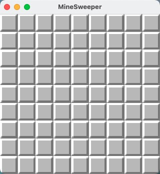
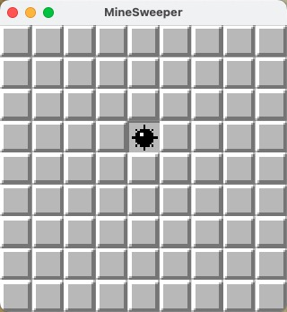
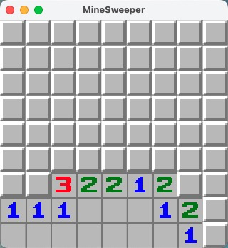

# 第三天：增加单元翻开的逻辑

## 1、准备工作

昨天我们展示了渲染棋盘，今天首先我们需要把他们都隐藏起来，只有点击的时候才显示实际格子。

修改`setup_board()`代码，把渲染的格子都改成覆盖层：
```rust
// main.rs
        .with_children(|commands| {
---         for (y, row) in board.map.iter().enumerate() {
---             for (x, column) in row.iter().enumerate() {
+++         for y in 0..options.height {
+++             for x in 0..options.width {
---                 let index = match column {
---                     1..=8 => { *column as usize }
---                     -1 => { 10 }
---                     _ => { 0 }
---                 };
                    commands.spawn((
                        SpriteSheetBundle {
                            texture_atlas: texture_atlas_handle.clone(),
                            sprite: TextureAtlasSprite {
---                             index: index,
+++                             index: 9,
                                ..Default::default()
                            },
                            transform: Transform::from_xyz(
                                tile_size * (x as f32) - offset.x,
                                offset.y - tile_size * (y as f32),
                                2.0
                            ),
                            ..default()
                        },
                    ));
                }
            }
        });
```
直接把素材的index改成9，渲染就自动变成了覆盖层，并且去除了一些已经用不到的代码。



如图所示，已经看不到棋盘实际的样子，只能看到格子都被覆盖

接下来我们创建一个`components`文件夹，我们来创建属于我们的第一个组件：坐标
```rust
// components/mod.rs
mod coordinate;

pub use coordinate::*;
```

```rust
// components/coordinate.rs
use bevy::prelude::*;

#[derive(Component, Clone, Copy, Debug, PartialEq, Eq)]
pub struct Coordinate {
    pub x: u16,
    pub y: u16,
}

impl Coordinate {
    pub fn new(x: u16, y: u16) -> Self {
        Self {
            x,
            y,
        }
    }
}
```

接下来，还是在`setup_board()`中，将坐标与我们的图片组合在一起。

```rust
// main.rs
        .with_children(|commands| {
            for y in 0..options.height {
                for x in 0..options.width {
                    commands.spawn((
                        SpriteSheetBundle {
                            texture_atlas: texture_atlas_handle.clone(),
                            sprite: TextureAtlasSprite {
                                index: 9,
                                ..Default::default()
                            },
                            transform: Transform::from_xyz(
                                tile_size * (x as f32) - offset.x,
                                offset.y - tile_size * (y as f32),
                                2.0
                            ),
                            ..default()
                        },
+++                     Coordinate::new(x, y),
                    ));
                }
            }
        });
```

在Bevy中，使用spawn生成Entity时，一起加入的都会打包为同一个Entity，后续就可以绑定使用。

当我们用到的时候就可以方便的根据坐标查询需要的格子属性并加以修改。

接下来我们就来开始做翻开的事件吧！

## 2、增加翻开事件到系统中

在`src`下增加`events.rs`保存我们所有的事件类型

```rust
// events.rs
use bevy::prelude::Event;

use crate::components::Coordinate;

#[derive(Debug, Copy, Clone, Event)]
pub struct TileUncoverEvent(pub Coordinate);
```

我们还需要把事件注册到系统中。

在`main()`中修改：

```rust
        .add_systems(Startup, setup_board)
+++     .add_event::<TileUncoverEvent>()
        .run();
```

现在事件有了，但是我们需要先捕获鼠标点击的事件，然后才能发送翻开的事件去处理，我们先写一个捕获鼠标事件的处理方法。

创建一个`systems`的目录，用来存放我们我们所有的系统。

在`systems`下创建`input.rs`：

```rust
// systems/input.rs
use bevy::{ prelude::*, input::{ mouse::MouseButtonInput, ButtonState } };

use crate::{ components::Coordinate, events::TileUncoverEvent };

pub fn input_handler(
    windows: Query<&mut Window>,
    camera: Query<(&Camera, &GlobalTransform)>,
    tiles: Query<(&Coordinate, &GlobalTransform)>,
    mut button_evr: EventReader<MouseButtonInput>,
    mut tile_uncover_ev: EventWriter<TileUncoverEvent>
) {
    let window = windows.single();
    let (camera, camera_transform) = camera.single();

    for event in button_evr.iter() {
        // 捕获松开鼠标的事件
        if event.state == ButtonState::Released {
            // 将鼠标点击的位置转换为相机中的实际位置
            let position = window
                .cursor_position()
                .and_then(|cursor| camera.viewport_to_world_2d(camera_transform, cursor))
                .unwrap();
            for (coord, transform) in tiles.iter() {
                // 判断点击所在的实体
                if in_transform(transform, position) {
                    println!("Mouse button release: {:?}", coord);
                    match event.button {
                        // 当点击左键时，发送一个翻开的事件
                        MouseButton::Left => {
                            tile_uncover_ev.send(TileUncoverEvent(coord.clone()));
                        }
                        _ => {}
                    }
                }
            }
        }
    }
}

/// 判断点击位置是否在Entity位置中
fn in_transform(transform: &GlobalTransform, position: Vec2) -> bool {
    let inx =
        transform.translation().x - 8.0 < position.x &&
        transform.translation().x + 8.0 > position.x;
    let iny =
        transform.translation().y - 8.0 < position.y &&
        transform.translation().y + 8.0 > position.y;
    inx && iny
}
```

这里开始，用到了一个bevy中很重要的东西，只要在参数中写一个query，Bevy会自动帮我们找到我们需要的Entity交给我们使用。

处理事件写好，我们还需要将他注册到系统中：

```rust
        .add_systems(Startup, setup_board)
+++     .add_systems(Update, systems::input::input_handler)
        .add_event::<TileUncoverEvent>()
        .run();
```

因为我们要随时捕获鼠标的点击，所以应该注册为Update类型。

现在运行程序，点击到每格格子上的时候，控制台就会输出：
```
Mouse button release: Coordinate { x: 6, y: 5 }
Mouse button release: Coordinate { x: 0, y: 0 }
Mouse button release: Coordinate { x: 2, y: 2 }
Mouse button release: Coordinate { x: 4, y: 2 }
Mouse button release: Coordinate { x: 5, y: 6 }
```

接下来我们继续编写翻开事件，

在`systems`下创建`uncover.rs`

```rust
// systems/uncover.rs
use bevy::prelude::*;

use crate::{ events::TileUncoverEvent, resources::Board, components::Coordinate };

pub fn uncover_tiles(
    board: Res<Board>,
    mut tiles: Query<(&mut TextureAtlasSprite, &Coordinate)>,
    mut tile_uncover_ev: EventReader<TileUncoverEvent>
) {
    for ev in tile_uncover_ev.iter() {
        let select = ev.0;
        // 找到对应坐标实体的精灵，修改index为实际单元格
        for (mut sprite, coord) in &mut tiles {
            if *coord == select {
                let column = board.map[select.y as usize][select.x as usize];
                let index = match column {
                    1..=8 => { column as usize }
                    -1 => { 10 }
                    _ => { 0 }
                };
                sprite.index = index;
                break;
            }
        }
    }
}

```
注册到系统中:
```rust
        .add_systems(Startup, setup_board)
---     .add_systems(Update, systems::input::input_handler)
+++     .add_systems(Update, (systems::input::input_handler, systems::uncover::uncover_tiles))
        .add_event::<TileUncoverEvent>()
        .run();
```
现在再运行程序，点击格子，发现他成功被翻开了，并且和数据中的一致



## 3、翻开连锁事件

当点击空白格时，应该连锁把周围的所有格子全部翻开，但是现在我们只是单独翻开一个格子，所以接下来我们再写一个事件，触发连锁

首先我们需要记录我们翻开的格子，否则连锁的时候就会不断循环，导致系统错误。

修改`board`增加存储操作的map并初始化，同时增加一个根据格子返回周围未操作的方法：

```rust
// resources/board.rs
    pub struct Board {
        pub map: Vec<Vec<i8>>,
+++     pub op_map: Vec<Vec<i8>>,
    }

    pub fn reset(&mut self, board_options: &Res<BoardOptions>) {
        /// ...
        self.map = map
            .chunks(width as usize)
            .map(|k| k.iter().cloned().collect::<Vec<_>>())
            .collect();
+++     self.op_map = (0..height)
+++         .into_iter()
+++         .map(|_|
+++             (0..width)
+++                 .into_iter()
+++                 .map(|_| 0)
+++                 .collect()
+++         )
+++         .collect();
        /// ...
    }
+++ pub fn adust_cover_around(&self, coord: (u16, u16)) -> Vec<(u16, u16)> {
+++     self.safe_square_at(coord)
+++         .into_iter()
+++         .filter(|c| self.op_map[c.1 as usize][c.0 as usize] == 0)
+++         .collect()
+++ }
```

在`events.rs`中增加一个检查事件

```rust
// events.rs
+++ #[derive(Debug, Copy, Clone, Event)]
+++ pub struct TileCheckEvent(pub Coordinate);
```

将写好的事件注册到系统中：

```rust
// main()
        .add_event::<TileUncoverEvent>()
+++     .add_event::<TileCheckEvent>()
        .run();
```

在`systems`下增加新的文件：

```rust
// systems/check.rs
use bevy::prelude::*;

use crate::{
    events::{ TileUncoverEvent, TileCheckEvent },
    resources::Board,
    components::Coordinate,
};

pub fn check_tiles(
    board: Res<Board>,
    mut tile_uncover_ev: EventWriter<TileUncoverEvent>,
    mut tile_check_ev: EventReader<TileCheckEvent>
) {
    for ev in tile_check_ev.iter() {
        let select = ev.0;
        println!("Check Tile: {:?}", select);
        let num = board.map[select.y as usize][select.x as usize];
        // 只有当格子是空白格时，触发连锁
        if num == 0 {
            board
                .adust_cover_around((select.x, select.y))
                .into_iter()
                .for_each(|coord|
                    board.op_map[coord.y as usize][coord.x as usize] = 1;
                    tile_uncover_ev.send(TileUncoverEvent(Coordinate::new(coord.0, coord.1)))
                );
        }
        // 当格子是地雷时，输出爆炸
        if num == -1 {
            println!("bomb!");
        }
    }
}
```

注册事件到系统中。

```rust
// main()
---     .add_systems(Update, (systems::input::input_handler, systems::uncover::uncover_tiles))
+++     .add_systems(Update, (
+++         systems::input::input_handler,
+++         systems::uncover::uncover_tiles,
+++         systems::check::check_tiles,
        ))
```

这个事件用来检查掀开的格子的状态。

例如：

当点击空白时触发连锁。

当点击到地雷，游戏结束(可以在课后自己先尝试实现这个功能)。

当全部格子都点击完，游戏胜利(可以在课后自己先尝试实现这个功能)。


但是这里我们还没有添加触发这个事件的地方，我们回到`uncover.rs`中，修改代码:

```rust
// systems/uncover.rs
    pub fn uncover_tiles(
---     board: Res<Board>,
+++     mut board: ResMut<Board>,
        mut tiles: Query<(&mut TextureAtlasSprite, &Coordinate)>,
        mut tile_uncover_ev: EventReader<TileUncoverEvent>,
+++     mut tile_check_ev: EventWriter<TileCheckEvent>
    ) {
        for ev in tile_uncover_ev.iter() {
            let select = ev.0;
            // 找到对应坐标实体的精灵，修改index为实际单元格
            for (mut sprite, coord) in &mut tiles {
                if *coord == select {
                    let column = board.map[select.y as usize][select.x as usize];
                    let index = match column {
                        1..=8 => { column as usize }
                        -1 => { 10 }
                        _ => { 0 }
                    };
                    sprite.index = index;
+++                 board.op_map[select.y as usize][select.x as usize] = 1;
+++                 tile_check_ev.send(TileCheckEvent(select));
                    break;
                }
            }
        }
    }
```

修改入参的board为可变引用，并且在点击后修改board的操作map对应位置为1，代表翻开，同时发送一个检查的事件。



如图所示，点击一个空白格子，所有旁边的格子都会自动翻开，点到雷的时候，控制台也会输出一个bomb!

但是控制台输出里，我们发现有些格子会重复的去检查，代表我们有些格子的事件重复了。

我们可以在uncover中增加检查只有op_map中为0的格子才进行操作，这样同时也可以挡掉重复点击事件：

```rust
    pub fn uncover_tiles(
        mut board: ResMut<Board>,
        mut tiles: Query<(&mut TextureAtlasSprite, &Coordinate)>,
        mut tile_uncover_ev: EventReader<TileUncoverEvent>,
        mut tile_check_ev: EventWriter<TileCheckEvent>
    ) {
        for ev in tile_uncover_ev.iter() {
            let select = ev.0;
+++         if board.op_map[select.y as usize][select.x as usize] != 0 {
+++             continue;
+++         }
            /// ...
        }
    }
```

现在，我们的扫雷已经可以正常进行翻开的操作了。

明天，我们会在这个基础上，继续增加标记的功能。