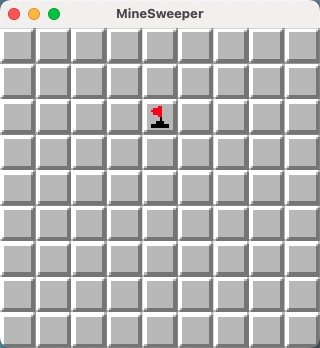
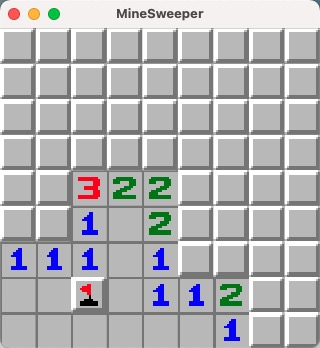
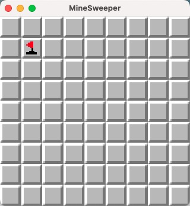
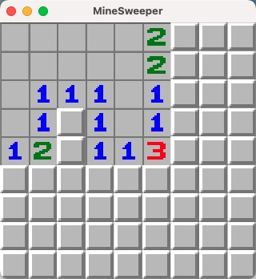

# 完成扫雷标记逻辑

今天我们来完成扫雷标记逻辑，因为都是前面几天中使用到的功能，所以会加快速度，省略一些部分代码。

## 整理代码

首先我们稍微整理一下之前的代码，将所有跟单元相关的代码放在一起：

在`system`下创建`tiles.rs`并将 `check.rs`和 `uncover.rs`中的代码转移过来

```rust
// systems/tiles.rs
use bevy::prelude::*;

use crate::{
    events::{ TileUncoverEvent, TileCheckEvent },
    resources::Board,
    components::Coordinate,
};

pub fn uncover_tiles(
    mut board: ResMut<Board>,
    mut tiles: Query<(&mut TextureAtlasSprite, &Coordinate)>,
    mut tile_uncover_ev: EventReader<TileUncoverEvent>,
    mut tile_check_ev: EventWriter<TileCheckEvent>
) {
    for ev in tile_uncover_ev.read() {
        let select = ev.0;
        if board.op_map[select.y as usize][select.x as usize] != 0 {
            continue;
        }
        // 找到对应坐标实体的精灵，修改index为实际单元格
        for (mut sprite, coord) in &mut tiles {
            if *coord == select {
                let column = board.map[select.y as usize][select.x as usize];
                let index = match column {
                    1..=8 => { column as usize }
                    -1 => { 10 }
                    _ => { 0 }
                };
                sprite.index = index;
                board.op_map[select.y as usize][select.x as usize] = 1;
                tile_check_ev.send(TileCheckEvent(select));
                break;
            }
        }
    }
}

pub fn check_tiles(
    board: Res<Board>,
    mut tile_uncover_ev: EventWriter<TileUncoverEvent>,
    mut tile_check_ev: EventReader<TileCheckEvent>
) {
    for ev in tile_check_ev.read() {
        let select = ev.0;
        println!("Check Tile: {:?}", select);
        let num = board.map[select.y as usize][select.x as usize];
        // 只有当格子是空白格时，触发连锁
        if num == 0 {
            board
                .adust_cover_around((select.x, select.y))
                .into_iter()
                .for_each(|coord|
                    tile_uncover_ev.send(TileUncoverEvent(Coordinate::new(coord.0, coord.1)))
                );
        }
        // 当格子是地雷时，输出爆炸
        if num == -1 {
            println!("bomb!");
        }
    }
}
```

将`main.rs`中的`setup_board`方法移动到单独的文件中:

```rust
// systems/board.rs
use bevy::prelude::*;

use crate::{resources::{BoardOptions, Board}, components::Coordinate};

pub fn setup_board(
    mut commands: Commands,
    options: Res<BoardOptions>,
    mut board: ResMut<Board>,
    asset_server: Res<AssetServer>,
    mut texture_atlases: ResMut<Assets<TextureAtlas>>
) {
    println!("{:?}", options);
    board.reset(&options);
    println!("{}", board.console_output());

    let texture_handle = asset_server.load("texture.png");
    let texture_atlas = TextureAtlas::from_grid(
        texture_handle,
        Vec2::new(16.0, 16.0),
        4,
        4,
        None,
        None
    );
    let texture_atlas_handle: Handle<TextureAtlas> = texture_atlases.add(texture_atlas);

    let tile_size = 16.0;
    let board_size = Vec2::new(
        (options.width as f32) * tile_size,
        (options.height as f32) * tile_size
    );
    let offset = (board_size - tile_size) / 2.0;
    commands
        .spawn((
            SpriteBundle {
                sprite: Sprite {
                    color: Color::WHITE,
                    custom_size: Some(board_size),
                    ..default()
                },
                transform: Transform::from_xyz(0.0, 0.0, 1.0),
                ..default()
            },
        ))
        .with_children(|commands| {
            for y in 0..options.height {
                for x in 0..options.width {
                    commands.spawn((
                        SpriteSheetBundle {
                            texture_atlas: texture_atlas_handle.clone(),
                            sprite: TextureAtlasSprite {
                                index: 9,
                                ..Default::default()
                            },
                            transform: Transform::from_xyz(
                                tile_size * (x as f32) - offset.x,
                                offset.y - tile_size * (y as f32),
                                2.0
                            ),
                            ..default()
                        },
                        Coordinate::new(x, y),
                    ));
                }
            }
        });
}
```
修改`main()`中和以上两处相关的代码

这样我们的代码就更清晰了一些，方便后续扩展

## 添加标记功能

增加`TileMarkEvent`事件并在`tiles.rs`中增加事件的处理逻辑

```rust
// systems/tiles.rs

/// ...
pub fn mark_tiles(
    mut board: ResMut<Board>,
    mut tiles: Query<(&mut TextureAtlasSprite, &Coordinate)>,
    mut tile_mark_ev: EventReader<TileMarkEvent>
) {
    for ev in tile_mark_ev.read() {
        let select = ev.0;
        let op = board.op_map[select.y as usize][select.x as usize];
        if op == 1 {
            continue;
        }
        for (mut sprite, coord) in &mut tiles {
            if *coord == select {
                if op == 0 {
                    println!("Mark Tile: {:?}", select);
                    sprite.index = 13;
                    board.op_map[select.y as usize][select.x as usize] = 2;
                    break;
                } else if op == 2 {
                    println!("Unmark Tile: {:?}", select);
                    sprite.index = 9;
                    board.op_map[select.y as usize][select.x as usize] = 0;
                    break;
                }
            }
        }
    }
}
```

别忘了把事件和处理系统注册到Bevy中。

当格子已经被掀开，就无法再被标记，所以处理1的格子不处理。

我们设置op_map中对标记的格子记录2，取消标记再修改回0。

接着我们增加在鼠标右键点击到单元格时发送事件：
```rust
// systems/input.rs
    pub fn input_handler(
        windows: Query<&mut Window>,
        camera: Query<(&Camera, &GlobalTransform)>,
        tiles: Query<(&Coordinate, &GlobalTransform)>,
        mut button_evr: EventReader<MouseButtonInput>,
        mut tile_uncover_ev: EventWriter<TileUncoverEvent>,
+++     mut tile_mark_ev: EventWriter<TileMarkEvent>
    ) {
        /// ...
                        match event.button {
                            // 当点击左键时，发送一个翻开的事件
                            MouseButton::Left => {
                                tile_uncover_ev.send(TileUncoverEvent(coord.clone()));
                            }
+++                         MouseButton::Right => {
+++                            tile_mark_ev.send(TileMarkEvent(coord.clone()));
+++                         }
                            _ => {}
                        }
        /// ...
    }
```

接下来我们运行程序，测试一下标记功能，已经可以正常工作了



但是这时候会发现一个问题，如果标记了之后，自动扩展空白格子时会卡死在标记格，但是按照原版功能，会将这种无效标记自动清除并翻开。



我们来修复一下这个问题：

这时候我们需要区分一下自动翻开和手动翻开了，手动点击时，依然不能翻开标记的格子，但是自动可以在扩展的时候翻开。

这里我的处理方式时在传递翻开事件时多加一个参数，区分手动和自动：
```rust
pub struct TileUncoverEvent(pub Coordinate, pub bool);
```
这里我的第二个参数代表是否为自动

同时在手动的时候传入`false`，在check中传入`true`

然后修改`uncover_tiles()`的代码：
```rust
// systems/tiles.rs
    pub fn uncover_tiles(
        mut board: ResMut<Board>,
        mut tiles: Query<(&mut TextureAtlasSprite, &Coordinate)>,
        mut tile_uncover_ev: EventReader<TileUncoverEvent>,
        mut tile_check_ev: EventWriter<TileCheckEvent>
    ) {
        for ev in tile_uncover_ev.read() {
            let select: Coordinate = ev.0;
---         if board.op_map[select.y as usize][select.x as usize] != 0 {
---             continue;
---         }
+++         let auto = ev.1;
+++         let op = board.op_map[select.y as usize][select.x as usize];
+++         // 已经掀开的不会再判断
+++         if op == 1 {
+++             continue;
+++         }
+++         // 点击事件时，标志的也不会再判断，自动扩展时，依然会翻开
+++         if !auto && op == 2 {
+++             continue;
+++         }
            /// ...
        }
    }
```

修改`board`资源`adust_cover_around()`中的判断条件，只有掀开的才会处理
```rust
// resources/board.rs
    pub fn adust_cover_around(&self, coord: (u16, u16)) -> Vec<(u16, u16)> {
        self.safe_square_at(coord)
            .into_iter()
---         .filter(|c| self.op_map[c.1 as usize][c.0 as usize] == 0)
+++         .filter(|c| self.op_map[c.1 as usize][c.0 as usize] != 1)
            .collect()
    }
```    

再次运行程序测试：




已经完美自动翻开所有格子
