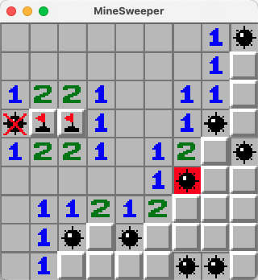
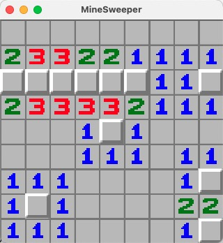
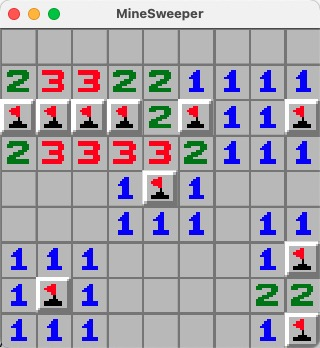

# 结束游戏，胜利或失败
今天我们来做完成游戏的逻辑，翻开地雷游戏失败，或者翻开所有非地雷格完成游戏

## 游戏失败
我们来创建一个游戏结束的事件和他的逻辑：

事件：
```rust
// events.rs
#[derive(Debug, Copy, Clone, Event)]
pub struct GameOverEvent(pub Coordinate);
```

逻辑：
```rust
// systems/over.rs
use bevy::prelude::*;

use crate::{ resources::Board, events::GameOverEvent, components::Coordinate };

pub fn game_over(
    board: Res<Board>,
    mut tiles: Query<(&mut TextureAtlasSprite, &Coordinate)>,
    mut game_over_ev: EventReader<GameOverEvent>
) {
    for ev in game_over_ev.read() {
        let select = ev.0;
        for (mut sprite, coord) in &mut tiles {
            let num = board.map[coord.y as usize][coord.x as usize];
            let op: i8 = board.op_map[coord.y as usize][coord.x as usize];
            if num == -1 && op == 0 {
                sprite.index = 10;
            }
            if op == 2 && num != -1 {
                sprite.index = 12;
            }
            if *coord == select {
                println!("Over Tile: {:?}", select);
                sprite.index = 11;
            }
        }
    }
}
```
在完成的逻辑中，我们翻开所有剩下的地雷格和标记错误的展示给用户，并将点击爆炸的格子修改为红色爆炸格

接着在`check_tiles()`中点击到地雷时发送游戏结束的事件：
```rust
// systems/tiles.rs

        // 当格子是地雷时，输出爆炸
        if num == -1 {
---         println!("bomb!");
+++         game_over_ev.send(GameOverEvent(select));
+++         break;
        }
```

运行程序，会有如图所示的效果：



但是现在游戏并没有结束，只是显示了结束的效果，我们还是可以继续操作

我们来引入状态来控制游戏的操作：

在`main.rs`中增加：
```rust
// main.rs
#[derive(States, Clone, Copy, Debug, Hash, PartialEq, Eq, Default)]
pub enum GameState {
    #[default]
    InGame,
    Over,
}
```
我们来使用这个控制游戏的状态

在`main()`中修改：
```rust
// main.rs

        .add_systems(Update, (
            systems::input::input_handler,
            systems::tiles::uncover_tiles,
            systems::tiles::check_tiles,
            systems::tiles::mark_tiles,
            systems::over::game_over,
---     ))
+++     ).run_if(in_state(GameState::InGame)))
+++     .add_state::<GameState>()
```
这里修改了我们的所有运行逻辑事件只在InGame时执行，这样保证游戏结束后就无法继续操作

接下来我们需要在游戏结束时修改系统状态：
```rust
// systems/over.rs
    pub fn game_over(
        board: Res<Board>,
        mut tiles: Query<(&mut TextureAtlasSprite, &Coordinate)>,
        mut game_over_ev: EventReader<GameOverEvent>,
+++     mut next_state: ResMut<NextState<GameState>>,
    ) {
        for ev in game_over_ev.read() {
+++         next_state.set(GameState::Over);
            /// ....
    }
```

现在再运行游戏，当点击到地雷时，游戏就结束，无法继续操作了。

## 游戏胜利
我们继续来开发游戏胜利的逻辑：

首先增加游戏胜利的事件：
```rust
// events.rs
#[derive(Debug, Copy, Clone, Event)]
pub struct GameWinEvent;
```

增加事件处理逻辑：
```rust
// systems/over.rs

    /// ...
    
    pub fn game_win(
        board: Res<Board>,
        mut tiles: Query<(&mut TextureAtlasSprite, &Coordinate)>,
        mut game_win_ev: EventReader<GameWinEvent>,
        mut next_state: ResMut<NextState<GameState>>,
    ) {
        for _ in game_win_ev.read() {
            println!("Win!");
            next_state.set(GameState::Over);
            for (mut sprite, coord) in &mut tiles {
                let num = board.map[coord.y as usize][coord.x as usize];
                let op: i8 = board.op_map[coord.y as usize][coord.x as usize];
                if op == 0 && num == -1 {
                    sprite.index = 13;
                }
            }
        }
    }
```
胜利时已经翻开所有非地雷，我们将所有地雷打上标记，然后让游戏结束。

将事件和逻辑注册到系统中(代码略)

在resources/board.rs增加判断局面胜利的方法：
```rust
// resources/board.rs
    // 当翻开的格子数量等于空白格子数量时，游戏胜利
    pub fn is_complete(&self) -> bool {
        self.map
            .concat()
            .into_iter()
            .filter(|c| *c >= 0)
            .count() ==
            self.op_map
                .concat()
                .into_iter()
                .filter(|c| *c == 1)
                .count()
    }
```

在`check_tiles()`中增加发出胜利事件：

```rust
// systems/tiles.rs
        /// ...
        // 当格子是地雷时，输出爆炸
        if num == -1 {
            game_over_ev.send(GameOverEvent(select));
            break;
        }
+++     if board.is_complete() {
+++         game_win_ev.send(GameWinEvent);
+++     }
```

这里要将胜利判断放在失败的后面，防止掀开的最后一个格子是雷，优先判断了胜利，但实际是失败的情况

接下来运行程序完成一局，如下图所示：




并且控制台输出`Win!`
游戏胜利!

